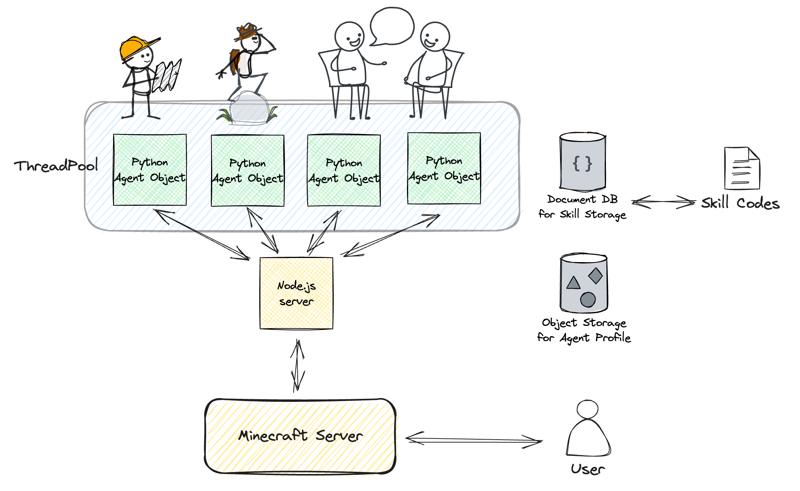

# ⛏️ minecraft-llm-agent-community

**This project will be resumed after June 18th, 2024, worldwide.**

- [🤖 Documentation Blog](https://naem1023.github.io/minecraft-llm-agent-community/)
  - [Architecture](https://naem1023.github.io/minecraft-llm-agent-community/docs/Architecture-of-Project)
  - [Installation Guide](https://naem1023.github.io/minecraft-llm-agent-community/docs/Installation)
- [📚 Analysis of Prior Projects](https://naem1023.github.io/minecraft-llm-agent-community/docs/Analysis-of-Prior-Projects)
  - [Simple Analysis of Voyager](https://naem1023.github.io/minecraft-llm-agent-community/docs/Analysis-of-Prior-Projects/voyager)

This project aims to observe how agents in the Minecraft world autonomously form groups and create villages. It is still in its early stages, and if valuable insights can be derived, it will be used as a research topic.

This project seeks to expand the research to include how multi-agents form groups, in addition to autonomously learning skills and exploring items, similar to [Voyager](https://github.com/MineDojo/Voyager).


<p align="center">
  
</p>

The purpose of this project can be changed, and welcome diverse opinions and feedback. Currently, I'm focusing on observing how issues of cooperation, coexistence, and survival are resolved. Additionally, most of my resources are currently invested in setting up the Minecraft environment, which has slowed the progress of core functionality development.

## TODO 
- [x] Basic Environment Setup using Voyager baseline
- [x] Make single agent using Voyager baseline
- [x] Analysis Voyager baseline and make a detail architecture image and pseudo code
- [ ] Setup an architecture for multi-agent based on Voyager
- [ ] Make simple multi agent 
- [ ] Improve agent can learn and explore interactive skiils like fighting, talking, and so on.
- [ ] Setup local llm via vllm or text-generation-inference
- [ ] Setup monitoring system for multi-agent

## Architecture
It's a sample architecture of executing a bot. It's not a final architecture.

## Installation Guides
Check the [Installation Document](https://naem1023.github.io/minecraft-llm-agent-community/docs/Documents/Installation)


# Contribution
## Check lint
```sh
make pre-commit
```

# Citation
```bibtex
@article{wang2023voyager,
  title   = {Voyager: An Open-Ended Embodied Agent with Large Language Models},
  author  = {Guanzhi Wang and Yuqi Xie and Yunfan Jiang and Ajay Mandlekar and Chaowei Xiao and Yuke Zhu and Linxi Fan and Anima Anandkumar},
  year    = {2023},
  journal = {arXiv preprint arXiv: Arxiv-2305.16291}
}
```
