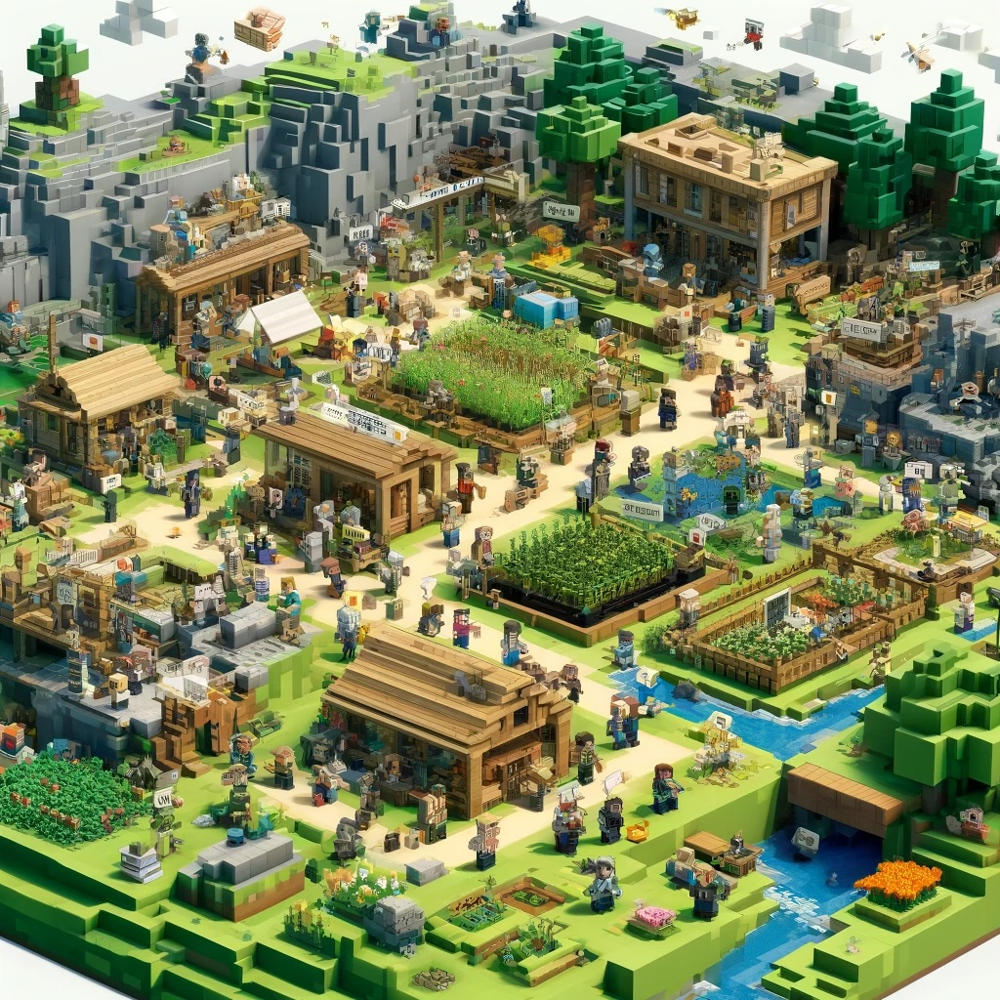

# Introduction
About ⛏️ minecraft-llm-agent-community.

This project aims to observe how agents in the Minecraft world autonomously form groups and create villages. It is still in its early stages, and if valuable insights can be derived, it will be used as a research topic.

This project seeks to expand the research to include how multi-agents form groups, in addition to autonomously learning skills and exploring items, similar to [Voyager](https://github.com/MineDojo/Voyager).

<!-- 

  

 -->

The purpose of this project can be changed, and welcome diverse opinions and feedback. Currently, I'm focusing on observing how issues of cooperation, coexistence, and survival are resolved. Additionally, most of my resources are currently invested in setting up the Minecraft environment, which has slowed the progress of core functionality development.
